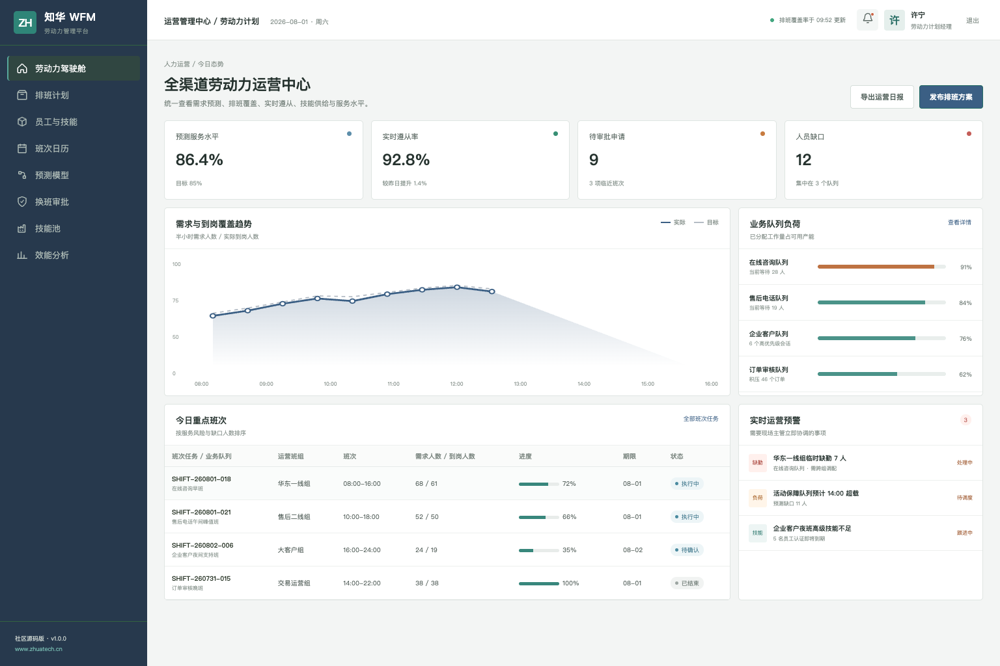
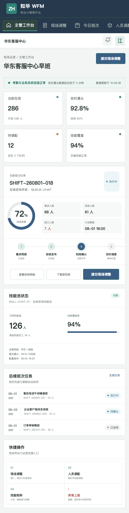

# ZhuaTech WFM

## 知华科技劳动力管理平台社区源码版

业务量每天都在变化，人员、技能和班次却不能靠临时表格反复协调。ZhuaTech WFM 将需求预测、排班计划、员工技能、实时遵从和现场调度放进一套可追踪的运营流程中。

本项目由知华科技（上海如静知华信息科技有限公司）发布。更多企业软件与技术服务请访问[知华科技官网](https://www.zhuatech.cn/)。

### 管理端：全渠道劳动力运营中心



管理人员可以比较需求与到岗趋势，查看业务队列负荷、班次缺口、换班审批和技能覆盖情况。

### 移动端：现场主管工作台



现场主管能够完成到岗确认、跨队列调度、技能查询和异常上报，并实时观察服务水平变化。

## 适用场景

- 客服中心、共享服务中心和业务运营团队
- 连锁门店、园区服务与多班次作业组织
- 对服务水平、工时合规和技能供给有精细管理要求的团队

## 功能清单

1. 业务量、平均处理时长和收缩率驱动的需求预测
2. 班次模板、休息规则、假期、换班与加班管理
3. 员工技能矩阵、认证有效期和跨队列匹配
4. 实时遵从、占用率、服务水平与现场调度
5. 人效、工时成本、排班公平性和预测准确率分析

所有截图数据均为产品演示用途，不对应真实客户或员工。

## 工程说明

```text
frontend  Vue 3 管理端与 H5
backend   Java 21 / Spring Boot API
MySQL     业务数据与 Flyway 版本迁移
compose   本地一键运行环境
```

Java 工程包名：`cn.zhuatech.wfm`；数据库名：`zhuatech_wfm`。

```bash
cd frontend
npm install
npm run dev:demo
```

打开 `http://localhost:5173`，管理端使用 `planner / Demo@2026`，现场端使用 `operator / Demo@2026`。生产化体验参考 [部署指南](deploy/README.md)，接口参考 [API 文档](docs/api.md)。

## 许可边界

本工程仅能用于个人学习、研究及非商业技术交流，**不得商用**。企业内部使用、生产环境部署、SaaS、软件交付、收费培训、咨询实施、二次销售和商业再分发均需取得上海如静知华信息科技有限公司书面授权，详见 [LICENSE](LICENSE)。

劳动力规划、智能排班、考勤系统集成、私有化部署或深度定制，可访问[知华科技官网](https://www.zhuatech.cn/)或扫描下方微信二维码咨询。

| 商务与技术咨询 | 项目深度定制 |
| --- | --- |
|  |  |

关键词：WFM 源码、劳动力管理系统、智能排班、人员预测、现场调度、客服排班、Java WFM、Vue 排班系统、知华科技。

## 人力覆盖预测

新增 `POST /api/wfm/insights/staffing-coverage`，按预测需求、平均处理时长、时间区间、收缩率和目标占用率计算所需人数与排班缺口，输出 `COVERED / TIGHT / UNDERSTAFFED`，并给出跨技能支援和错峰安排建议。
